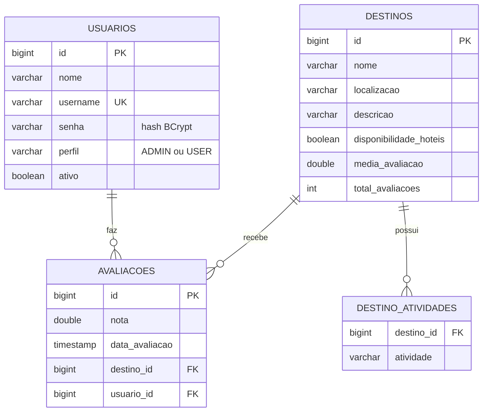

# API de Gerenciamento de Destinos de Viagem — Etapa 2

Trabalho da disciplina **Desenvolvimento de Sistemas Web** — Evolução da API com
**banco de dados (PostgreSQL + Spring Data JPA)** e **segurança (Spring Security)**.

API RESTful em **Java 17 + Spring Boot 3** para uma agência de viagens. Na etapa 1
os destinos ficavam em memória e a API era aberta a qualquer pessoa. Nesta etapa
os dados passam a ser **persistidos em PostgreSQL** e o acesso é **controlado por
autenticação e por perfil de usuário (ADMIN e USER)**.

---

## 1. O que mudou em relação à etapa 1

| Aspecto | Etapa 1 | Etapa 2 |
|---|---|---|
| Armazenamento | `ConcurrentHashMap` na memória da JVM | PostgreSQL, via Spring Data JPA / Hibernate |
| Entidades | Classe `Destino` simples (POJO) | `Destino`, `Usuario` e `Avaliacao` como entidades JPA |
| Acesso a dados | Feito dentro do `Service` | Camada `repository` (interfaces `JpaRepository`) |
| Avaliações | Só a média era guardada | Cada nota é gravada (usuário × destino) e a média é recalculada a partir delas |
| Segurança | Nenhuma | Spring Security: login com usuários do banco, senhas BCrypt, perfis ADMIN/USER |
| Respostas | A entidade era devolvida diretamente | DTOs de resposta (`DestinoResponseDTO`, `UsuarioResponseDTO`) |
| Erros | Exceções inesperadas viravam 500 | JSON inválido, id malformado e rota inexistente viram 400/404; 401/403 também em JSON |
| Testes | Apenas `contextLoads` | Testes de integração de CRUD, autenticação e autorização |

---

## 2. Arquitetura

Continua a **arquitetura em camadas** da etapa 1, agora com a camada de
`repository` e um filtro de segurança na frente dos controllers:

```
Requisição HTTP
      │
      ▼
┌──────────────────────────┐
│  Spring Security (filtros)│  Autentica (HTTP Basic + usuários do banco) e
│      SecurityConfig       │  autoriza por perfil. Sem credenciais → 401;
└────────────┬─────────────┘  perfil sem permissão → 403.
             ▼
┌──────────────────────────┐
│       Controller          │  Recebe a requisição, valida o formato de entrada
│ DestinoController         │  (@Valid) e devolve a resposta HTTP. Não contém
│ AuthController            │  regra de negócio nem acessa o banco.
└────────────┬─────────────┘
             ▼
┌──────────────────────────┐
│        Service            │  Regras de negócio e transações (@Transactional):
│ DestinoService            │  cálculo da média, filtros de pesquisa, exclusão
│ UsuarioService            │  em cascata, criptografia da senha.
└────────────┬─────────────┘
             ▼
┌──────────────────────────┐
│       Repository          │  Interfaces Spring Data JPA. O Spring gera a
│ Destino/Usuario/Avaliacao │  implementação (save, findById, delete, consultas
│ Repository                │  derivadas do nome do método...).
└────────────┬─────────────┘
             ▼
        PostgreSQL
```

Camadas de apoio: **model** (entidades JPA), **dto** (dados de entrada e saída),
**exception** (respostas de erro padronizadas), **security** (integração com o
banco e respostas 401/403) e **config** (segurança e carga inicial de dados).

### Memória × banco de dados

Na etapa 1, os destinos viviam em um `Map` dentro do `Service`, ou seja, na
**memória da aplicação**: rápido, mas volátil — ao reiniciar, tudo se perdia, e
duas instâncias da API não compartilhariam os dados. Agora cada destino é uma
**linha na tabela `destinos`** do PostgreSQL: os dados sobrevivem a reinicializações,
são consultáveis por qualquer ferramenta SQL e podem ser compartilhados por várias
instâncias. Para comprovar: cadastre um destino, reinicie a aplicação e liste
novamente — ele continua lá.

---

## 3. Modelo de dados



- **`usuarios`**: a senha é armazenada **somente como hash BCrypt**. O `username` é único.
- **`destinos`** + **`destino_atividades`**: a lista de atividades turísticas é uma
  `@ElementCollection` (tabela auxiliar).
- **`avaliacoes`**: relacionamentos `@ManyToOne` com destino e usuário. Há uma
  *constraint* única (`usuario_id`, `destino_id`): cada usuário tem **uma** avaliação
  por destino; avaliar de novo substitui a nota anterior.
- `media_avaliacao` e `total_avaliacoes` em `destinos` são valores derivados da tabela
  de avaliações, mantidos para que a listagem não precise recalcular a média de todos
  os destinos a cada consulta.

As tabelas são criadas automaticamente pelo Hibernate (`spring.jpa.hibernate.ddl-auto=update`).

---

## 4. Requisitos

- **Java 17** ou superior (JDK)
- **Maven 3.8+**
- **PostgreSQL 14+** — ou **Docker**, para subir o banco com um comando
- Para os testes automatizados **não** é necessário PostgreSQL (usam H2 em memória)

---

## 5. Configuração e execução

### 5.1 Criar o banco de dados

**Opção A — Docker (mais simples).** Na raiz do projeto:

```bash
docker compose up -d
```

Isso sobe um PostgreSQL 16 na porta 5432 com o banco `destinos_db`, usuário
`postgres` e senha `postgres` (exatamente os padrões da aplicação).

**Opção B — PostgreSQL instalado na máquina.** Crie apenas o banco (as tabelas são
criadas pela aplicação):

```bash
psql -U postgres -c "CREATE DATABASE destinos_db;"
```

### 5.2 Configuração da conexão (`application.properties`)

A conexão fica em `src/main/resources/application.properties` e pode ser
sobrescrita por **variáveis de ambiente**, sem alterar o código:

| Propriedade | Variável de ambiente | Padrão |
|---|---|---|
| `spring.datasource.url` | `DB_URL` | `jdbc:postgresql://localhost:5432/destinos_db` |
| `spring.datasource.username` | `DB_USERNAME` | `postgres` |
| `spring.datasource.password` | `DB_PASSWORD` | `postgres` |
| `spring.jpa.show-sql` | `SHOW_SQL` | `false` (use `true` para ver o SQL no console) |
| `app.seed.enabled` | `APP_SEED_ENABLED` | `true` (cria usuários e destinos de exemplo) |
| `app.seed.admin.password` | `SEED_ADMIN_PASSWORD` | `admin123` |
| `app.seed.user.password` | `SEED_USER_PASSWORD` | `user123` |

Exemplo com um banco diferente (Linux/macOS/Git Bash):

```bash
export DB_URL=jdbc:postgresql://localhost:5432/meu_banco
export DB_USERNAME=meu_usuario
export DB_PASSWORD=minha_senha
```

### 5.3 Executar a aplicação

```bash
mvn spring-boot:run
```

A API sobe em `http://localhost:8080`. Na **primeira** execução a aplicação cria as
tabelas e os dados iniciais (2 usuários de teste e 2 destinos); nas seguintes, não
duplica nada.

### 5.4 Executar os testes

```bash
mvn test
```

Os testes sobem a aplicação completa com um banco **H2 em memória** (perfil `test`) e
verificam CRUD, avaliações, login, criptografia da senha e as regras de acesso por
perfil (401 e 403), passando pelos filtros reais do Spring Security.

---

## 6. Usuários e perfis de teste

Criados automaticamente na primeira execução (`DataInitializer`):

| Usuário | Senha | Perfil |
|---|---|---|
| `admin` | `admin123` | **ADMIN** |
| `usuario` | `user123` | **USER** |

> Essas senhas são apenas para desenvolvimento e avaliação. Em qualquer outro ambiente,
> defina `SEED_ADMIN_PASSWORD` e `SEED_USER_PASSWORD` ou desative a carga inicial com
> `APP_SEED_ENABLED=false`.

Novos usuários podem ser criados por `POST /api/auth/registro` e **sempre** recebem o
perfil `USER` (não é possível se cadastrar como ADMIN).

---

## 7. Segurança

- **Autenticação:** HTTP Basic (cabeçalho `Authorization` com usuário e senha). O
  Spring Security consulta o usuário na tabela `usuarios` (`UsuarioDetailsService`) e
  compara a senha enviada com o **hash BCrypt** armazenado. A senha nunca é guardada
  nem devolvida em texto puro.
- **Stateless:** o servidor não mantém sessão; cada requisição traz suas credenciais.
  CSRF está desabilitado por esse motivo (não há cookie de sessão a proteger).
- **Autorização:** regras por método HTTP e rota, em `SecurityConfig`, baseadas no perfil.
- **Respostas de erro de segurança em JSON:**
  - `401 Unauthorized` — sem credenciais, ou usuário/senha incorretos;
  - `403 Forbidden` — autenticado, mas o perfil não permite a operação.

### Matriz de acesso

| Método | Rota | Acesso |
|---|---|---|
| `POST` | `/api/auth/registro` | Público |
| `GET` | `/api/auth/me` | Qualquer usuário autenticado |
| `GET` | `/api/destinos` e `/api/destinos/{id}` | Público (consulta) |
| `PATCH` | `/api/destinos/{id}/avaliacoes` | **USER** ou **ADMIN** |
| `POST` | `/api/destinos` | **ADMIN** |
| `PUT` | `/api/destinos/{id}` | **ADMIN** |
| `DELETE` | `/api/destinos/{id}` | **ADMIN** |

Qualquer rota não listada acima exige autenticação.

---

## 8. Endpoints e exemplos

Base URL: `http://localhost:8080`

> Os exemplos usam `curl` (Linux/macOS/Git Bash). No Windows, prefira Postman ou
> Insomnia: em **Authorization**, escolha **Basic Auth** e informe usuário e senha.

### Consultar (público)

```bash
# listar todos
curl http://localhost:8080/api/destinos

# pesquisar por nome e/ou localização (contém, sem diferenciar maiúsculas)
curl "http://localhost:8080/api/destinos?nome=praia"
curl "http://localhost:8080/api/destinos?localizacao=santa+catarina"

# detalhar
curl http://localhost:8080/api/destinos/1
```

### Cadastrar destino — somente ADMIN

```bash
curl -u admin:admin123 -X POST http://localhost:8080/api/destinos \
  -H "Content-Type: application/json" \
  -d '{"nome":"Fernando de Noronha","localizacao":"Pernambuco, Brasil","descricao":"Arquipélago com praias preservadas e mergulho.","atividadesTuristicas":["Mergulho","Trilhas"],"disponibilidadeHoteis":true}'
```

Resposta: `201 Created`, cabeçalho `Location` e o destino criado (com `id`).

### Atualizar e excluir — somente ADMIN

```bash
curl -u admin:admin123 -X PUT http://localhost:8080/api/destinos/1 \
  -H "Content-Type: application/json" \
  -d '{"nome":"Praia do Rosa","localizacao":"Imbituba, SC","descricao":"Atualizado","atividadesTuristicas":["Surf"],"disponibilidadeHoteis":true}'

curl -u admin:admin123 -X DELETE http://localhost:8080/api/destinos/1   # 204 No Content
```

### Avaliar destino — USER ou ADMIN

```bash
curl -u usuario:user123 -X PATCH http://localhost:8080/api/destinos/2/avaliacoes \
  -H "Content-Type: application/json" -d '{"nota": 4.5}'
```

A nota deve estar entre `0.0` e `5.0`. A resposta traz `mediaAvaliacao` e
`totalAvaliacoes` atualizados. Cada usuário tem uma avaliação por destino: avaliar
de novo substitui a nota anterior.

### Conta

```bash
# criar usuário (perfil USER)
curl -X POST http://localhost:8080/api/auth/registro \
  -H "Content-Type: application/json" \
  -d '{"nome":"Maria Silva","username":"maria.silva","senha":"segredo123"}'

# conferir credenciais e perfil
curl -u maria.silva:segredo123 http://localhost:8080/api/auth/me
```

`username`: 3 a 50 caracteres (letras minúsculas, números, `.`, `-` ou `_`). `senha`: 6 a 72 caracteres.

### Testando as regras de acesso

```bash
curl -i -X POST http://localhost:8080/api/destinos -H "Content-Type: application/json" -d '{}'
# → 401 (sem credenciais)

curl -i -u usuario:user123 -X DELETE http://localhost:8080/api/destinos/1
# → 403 (USER não pode excluir)

curl -i -u admin:admin123 -X DELETE http://localhost:8080/api/destinos/1
# → 204 (ADMIN pode)
```

### Formato dos erros

Todos os erros seguem o mesmo formato JSON:

```json
{
  "timestamp": "2026-09-19T10:15:30.123",
  "status": 400,
  "erro": "Dados invalidos",
  "mensagem": "Um ou mais campos enviados sao invalidos",
  "camposInvalidos": { "nome": "O nome do destino e obrigatorio" }
}
```

| Status | Quando |
|---|---|
| 400 | Dados inválidos, JSON malformado, id não numérico |
| 401 | Sem credenciais ou credenciais incorretas |
| 403 | Perfil sem permissão para a operação |
| 404 | Destino/rota inexistente |
| 409 | Username já cadastrado |
| 500 | Erro inesperado (detalhes apenas no log do servidor) |

---

## 9. Verificando os dados no banco

```bash
docker exec -it destinos-postgres psql -U postgres -d destinos_db
```

```sql
SELECT id, username, perfil, senha FROM usuarios;   -- a coluna senha mostra o hash BCrypt ($2a$10$...)
SELECT id, nome, localizacao, media_avaliacao, total_avaliacoes FROM destinos;
SELECT * FROM avaliacoes;
```

---

## 10. Estrutura do projeto

```
destinos-api-viagens/
├── pom.xml
├── docker-compose.yml                      # PostgreSQL para desenvolvimento
├── README.md
└── src/
    ├── main/
    │   ├── java/com/agencia/destinosapi/
    │   │   ├── DestinosApiApplication.java
    │   │   ├── config/
    │   │   │   ├── SecurityConfig.java      # regras de acesso, BCrypt, HTTP Basic
    │   │   │   └── DataInitializer.java     # usuários e destinos de exemplo
    │   │   ├── controller/
    │   │   │   ├── DestinoController.java
    │   │   │   └── AuthController.java      # registro e /me
    │   │   ├── service/
    │   │   │   ├── DestinoService.java
    │   │   │   └── UsuarioService.java
    │   │   ├── repository/
    │   │   │   ├── DestinoRepository.java
    │   │   │   ├── UsuarioRepository.java
    │   │   │   └── AvaliacaoRepository.java
    │   │   ├── model/
    │   │   │   ├── Destino.java
    │   │   │   ├── Usuario.java
    │   │   │   ├── Avaliacao.java
    │   │   │   └── Perfil.java              # enum ADMIN, USER
    │   │   ├── dto/                         # dados de entrada e de saída (records)
    │   │   ├── security/
    │   │   │   ├── UsuarioDetailsService.java
    │   │   │   ├── RestAuthenticationEntryPoint.java   # 401 em JSON
    │   │   │   └── RestAccessDeniedHandler.java        # 403 em JSON
    │   │   └── exception/                   # respostas de erro padronizadas
    │   └── resources/application.properties
    └── test/
        ├── java/com/agencia/destinosapi/    # testes de integração
        └── resources/application-test.properties   # H2 em memória (só nos testes)
```

---

## 11. Decisões de projeto

- **HTTP Basic com usuários no banco** foi escolhido por ser simples de configurar,
  de testar (curl/Postman) e de explicar, atendendo ao escopo da etapa. Como a senha
  trafega em cada requisição (apenas codificada em Base64), **em produção a API
  deve ser servida por HTTPS**.
- **Consulta pública, alteração protegida:** listar e detalhar destinos é aberto
  (útil para apps de turismo e parceiros); avaliar exige login; alterar o catálogo
  é exclusivo do ADMIN.
- **Perfil no registro:** o cliente não escolhe o perfil, evitando que alguém se
  cadastre como ADMIN.
- **DTOs** separam o contrato da API do modelo de banco.
- **`ddl-auto=update`** facilita o desenvolvimento; em produção o recomendado é
  `validate` com migrações versionadas (Flyway/Liquibase).

## 12. Próximos passos (fora do escopo desta entrega)

- Autenticação por **token JWT** (endpoint de login) no lugar de HTTP Basic.
- Documentação interativa com **Swagger/OpenAPI**.
- **Paginação** na listagem de destinos.
- Migrações de banco com **Flyway**.
